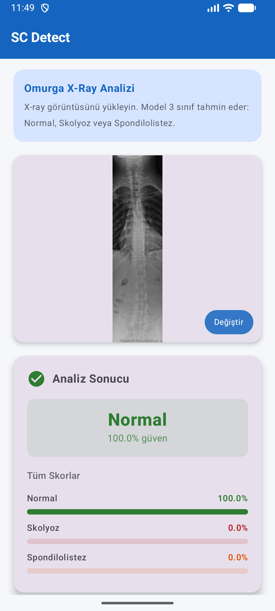
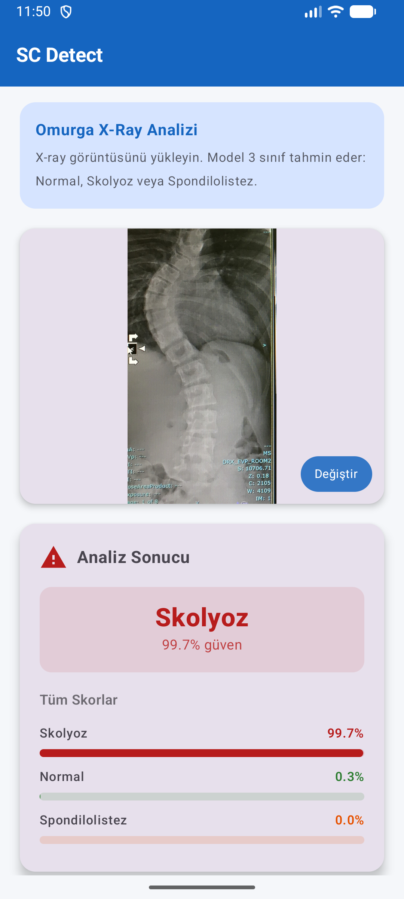
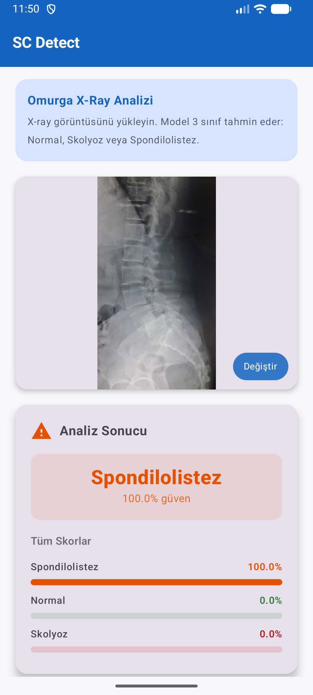
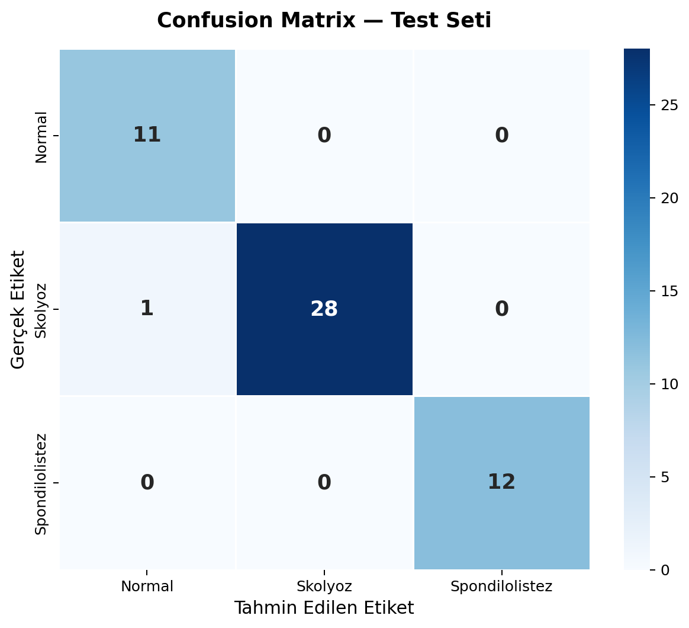
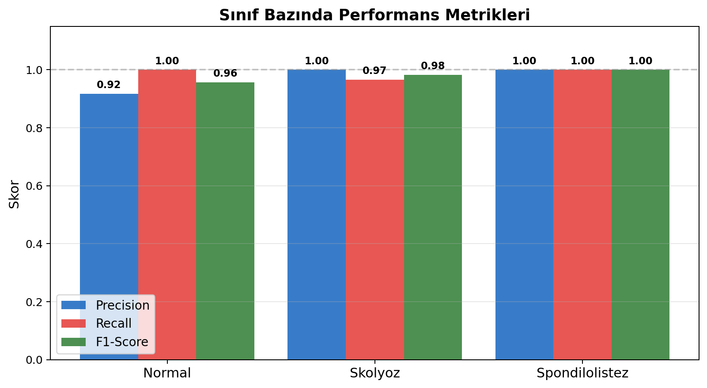

# SCDetect — Omurga X-Ray Sınıflandırma Uygulaması

Android uygulaması, omurga X-ray görüntülerinden **skolyoz**, **spondilolistez** ve **normal** durumları tespit etmek için MobileNetV2 tabanlı derin öğrenme modeli kullanır.

## Ekran Görüntüleri

<p align="center">
  
  
  
</p>
<p align="center">
  <em>Soldan sağa: Normal · Skolyoz · Spondilolistez</em>
</p>

## Model Performansı

| Sınıf | Precision | Recall | F1-Score |
|---|---|---|---|
| Normal | 0.92 | 1.00 | 0.96 |
| Skolyoz | 1.00 | 0.97 | 0.98 |
| Spondilolistez | 1.00 | 1.00 | 1.00 |
| **Genel** | **0.98** | **0.98** | **0.98** |

**Test Doğruluğu: %98.1**

<p align="center">
  
  
</p>

## Teknolojiler

- **Model:** MobileNetV2 + Transfer Learning (TensorFlow 2.21)
- **Export:** TensorFlow Lite (4.6 MB)
- **Android:** Kotlin + Jetpack Compose
- **Min SDK:** API 28 (Android 9)

## Veri Seti

[Vertebrae X-Ray Images — Mendeley Data](https://data.mendeley.com/datasets/xkt857dsxk/1)

| Sınıf | Toplam | Eğitim | Doğrulama | Test |
|---|---|---|---|---|
| Normal | 71 | 49 | 11 | 11 |
| Skolyoz | 188 | 131 | 28 | 29 |
| Spondilolistez | 79 | 55 | 12 | 12 |

## Kurulum

1. Repo'yu klonla
```bash
git clone https://github.com/iebayirli/SCDetect.git
```
2. Android Studio'da aç
3. Gradle sync bekle
4. Çalıştır

## Kullanım

1. Uygulamayı aç
2. **X-Ray Görüntüsü Seç** butonuna dokun
3. Galeriden omurga X-ray görüntüsü seç
4. Anlık tahmin ve güven skorlarını gör

> **Uyarı:** Bu uygulama yalnızca araştırma amaçlıdır. Klinik tanı için kullanılamaz.

## Lisans

MIT
